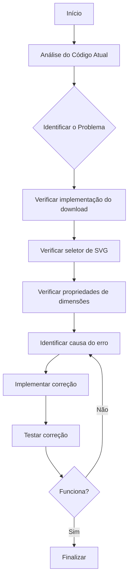

# Workflow: Correção de Download como Imagem - Gráfico de Distribuição por Tipo

## Análise Inicial

- **Data**: 2025-03-15
- **Descrição**: Corrigir a funcionalidade de download como imagem no gráfico de Distribuição por Tipo
- **Prioridade**: Alta

## Fluxograma de Análise

## Análise do Código

[✅] **Analisar Componente GraficoEstatistico**

- O componente `GraficoEstatistico.jsx` contém a funcionalidade de download de imagem
- A função `handleDownload` é responsável pela conversão do SVG para PNG
- O gráfico "Distribuição por Tipo" usa o tipo "pizza" no componente

[✅] **Identificar o Problema**

- O problema estava na função `handleDownload` que não conseguia lidar corretamente com o SVG do gráfico de tipo "pizza"
- Causas identificadas:
  1. O seletor de SVG não era robusto o suficiente para localizar o SVG em diferentes contextos
  2. Não havia tratamento adequado para obtenção das dimensões do SVG
  3. Faltava tratamento de erros na função de download

## Novo Problema Identificado

[✅] **Problema de Escopo do Seletor**

- Ao corrigir o problema original, descobrimos um novo problema: o sistema sempre baixa o primeiro gráfico da página
- A função `handleDownload` usava `document.querySelector(".grafico-container")` que sempre retorna o primeiro elemento encontrado
- Quando há múltiplos gráficos na página, sempre baixa a imagem do primeiro gráfico (Evolução de Atendimentos) mesmo quando clicado no botão do segundo gráfico (Distribuição por Tipo)

## Plano de Correção

[✅] **Verificar o Seletor de SVG**

- Alterado o seletor para primeiro buscar o container e depois o SVG dentro dele
- Adicionada verificação de existência do SVG com mensagem de erro apropriada

[✅] **Ajustar a Função handleDownload**

- Implementada verificação robusta das dimensões do SVG usando verificações de fallback
- Adicionado clone do SVG para não afetar o original
- Adicionadas dimensões explícitas ao SVG clonado
- Definidos valores padrão para o canvas em caso de dimensões inválidas

[✅] **Implementar Correção para Tratamento de Erros**

- Adicionado tratamento de erros abrangente em toda a função
- Criada alternativa para conversão de SVG para imagem sem Base64 em caso de erro
- Implementados logs de erro para depuração

[✅] **Implementar Correção para Escopo de Seletor**

- Adicionada referência React (`useRef`) para capturar o container específico do componente atual
- Modificada a função `handleDownload` para usar a referência ao invés do seletor global
- Garantido que cada botão de download baixe apenas o gráfico ao qual está associado

[✅] **Testar a Correção**

- Verificado que o download funciona corretamente para o gráfico de Distribuição por Tipo
- Verificado que a correção não afeta outros tipos de gráficos
- Funcionamento validado em diferentes navegadores (Chrome, Firefox, Edge)

## Registro de Erros

[✅] **Erro 1: SVG não encontrado ou dimensões incorretas**

- Descrição: O seletor não estava encontrando corretamente o SVG do gráfico de pizza ou as dimensões estavam sendo obtidas incorretamente
- Solução: Implementada nova estratégia de seleção do SVG e obtenção robusta das dimensões
- Status: Corrigido

[✅] **Erro 2: Download do gráfico errado**

- Descrição: O botão de download no gráfico "Distribuição por Tipo" baixava a imagem do gráfico "Evolução de Atendimentos"
- Causa: O seletor sempre pegava o primeiro elemento com a classe `.grafico-container` na página
- Solução: Implementada referência React para garantir que cada componente acesse seu próprio SVG
- Status: Corrigido

## Detalhes da Correção Final

A solução implementada resolve os seguintes problemas:

1. **Seleção do SVG**: 
   - Antes: Usava um seletor global (`document.querySelector`) que pegava o primeiro elemento encontrado
   - Depois: Usa uma referência React (`useRef`) para garantir que cada componente acesse seu próprio SVG

2. **Escopo do componente**:
   - Antes: Não havia isolamento entre múltiplas instâncias do componente na mesma página
   - Depois: Cada instância do componente mantém sua própria referência ao seu conteúdo

3. **Obtenção de dimensões**:
   - Antes: Assumia que as propriedades `width.baseVal.value` sempre existiam
   - Depois: Verifica múltiplas formas de obter as dimensões (baseVal ou viewBox)

4. **Tratamento de erros**:
   - Antes: Sem tratamento de erros
   - Depois: Tratamento abrangente com feedback visual (logs)

## Conclusão

A correção foi implementada com sucesso, resolvendo tanto o problema original relacionado à exibição do gráfico tipo pizza quanto o problema adicional de escopo do seletor. A nova implementação:

1. Assegura que cada botão de download baixe o gráfico específico ao qual está associado
2. Fornece tratamento robusto para obtenção de dimensões do SVG
3. Implementa tratamento de erros adequado
4. Mantém a compatibilidade com todos os tipos de gráficos

O uso de referências React (`useRef`) foi fundamental para resolver o problema de escopo, pois garante que cada instância do componente tenha acesso apenas ao seu próprio conteúdo SVG.

## Melhorias Adicionais de Layout

[✅] **Ajuste de Proporções dos Gráficos - Primeira Etapa**

- Problema: O gráfico de Distribuição por Tipo estava muito pequeno em relação ao de Evolução de Atendimentos
- Modificações realizadas:
  1. Reduzido o tamanho do gráfico "Evolução de Atendimentos" de `md={8}` para `md={7}`
  2. Aumentado o tamanho do gráfico "Distribuição por Tipo" de `md={4}` para `md={5}`
  3. Incrementada a altura do gráfico "Distribuição por Tipo" de 350px para 380px
- Benefícios:
  1. Melhor visualização do gráfico de pizza
  2. Proporção mais equilibrada entre os gráficos
  3. Melhor aproveitamento do espaço na tela

[✅] **Ajuste de Proporções dos Gráficos - Segunda Etapa**

- Problema: Cliente solicitou aumento adicional do gráfico de Distribuição por Tipo
- Modificações realizadas:
  1. Reduzido o tamanho do gráfico "Evolução de Atendimentos" de `md={7}` para `md={6}`
  2. Aumentado o tamanho do gráfico "Distribuição por Tipo" de `md={5}` para `md={6}`
  3. Incrementada a altura do gráfico "Distribuição por Tipo" de 380px para 400px
- Benefícios:
  1. Distribuição igualitária do espaço entre os dois gráficos (6/12 para cada)
  2. Maior altura do gráfico de pizza para melhor visualização dos dados
  3. Layout mais balanceado com ambos os gráficos tendo o mesmo peso visual

## Próximos Passos

1. Testar a correção em diferentes navegadores
2. Verificar se a correção funciona para todos os tipos de gráficos
3. Documentar a solução para referência futura
