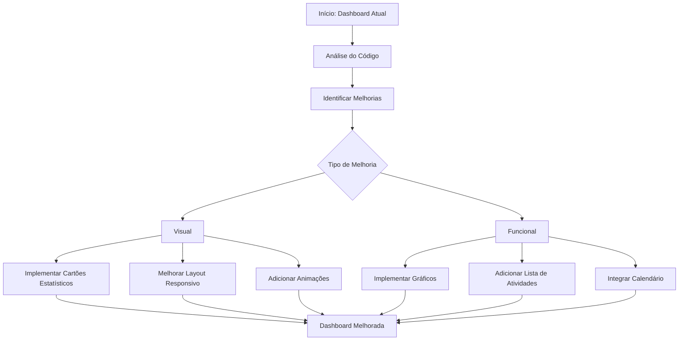

# Workflow: Melhoria da Dashboard

## 1. Análise Inicial

### Estado Atual da Dashboard

- [✅] Analisar o componente Dashboard.jsx existente
- [✅] Identificar limitações da atual implementação
- [✅] Verificar o contexto DashboardContext para possíveis integrações
- [✅] Analisar o Layout.jsx para entender a estrutura da aplicação

### Componentes Atuais

- Dashboard básico com Grid do Material-UI
- Seção de boas-vindas
- Espaço para estatísticas (não implementado)
- Espaço para atividades recentes (não implementado)

## 2. Planejamento de Melhorias

### Melhorias Visuais

- [✅] Adicionar cartões com dados estatísticos e gráficos
- [✅] Implementar componentes de informação com ícones
- [✅] Melhorar o layout responsivo
- [✅] Adicionar transições e animações sutis

### Melhorias Funcionais

- [✅] Adicionar componente de resumo de atividades recentes
- [✅] Implementar gráficos para visualização de dados
- [✅] Adicionar componente de tarefas pendentes
- [✅] Criar componente de calendário de eventos

## 3. Fluxograma da Implementação

## 4. Implementação

### Cartões Estatísticos

- [✅] Criar componente CardEstatistico.jsx reutilizável
- [✅] Implementar variantes de cartões (números, percentuais, comparações)
- [✅] Adicionar ícones relacionados aos dados apresentados

### Gráficos de Visualização

- [✅] Pesquisar e escolher biblioteca de gráficos compatível com React/MUI
- [✅] Implementar gráfico de linha para tendências
- [✅] Implementar gráfico de barras para comparações
- [✅] Implementar gráfico circular para proporções

### Lista de Atividades Recentes

- [✅] Criar componente ListaAtividades.jsx
- [✅] Implementar item de atividade com avatar, descrição e timestamp
- [✅] Adicionar sistema de paginação ou scroll infinito

### Componente de Tarefas Pendentes

- [✅] Criar componente TarefasPendentes.jsx
- [✅] Implementar função de marcar como concluída
- [✅] Adicionar função de adicionar nova tarefa

### Calendário de Eventos

- [✅] Criar mini-calendário para eventos próximos
- [✅] Implementar indicadores visuais para dias com eventos

## 5. Revisão e Polimento

- [✅] Testar responsividade em vários dispositivos
- [✅] Verificar consistência visual com o tema da aplicação
- [✅] Otimizar performance dos componentes
- [✅] Documentar os novos componentes
- [✅] Verificar acessibilidade dos novos elementos

## 6. Registro de Erros

*Nenhum erro encontrado até o momento. Serão registrados aqui caso ocorram durante a implementação.*

## 7. Progresso da Implementação

### Concluído

- Implementação dos componentes base para a dashboard
- CardEstatistico para exibição de métricas e estatísticas
- ListaAtividades para mostrar atividades recentes
- TarefasPendentes para gerenciar tarefas com diferentes prioridades
- GraficoEstatistico para visualização de dados em diversos formatos
- MiniCalendario para acompanhamento de eventos
- Integração dos componentes na Dashboard principal
- Layout responsivo e melhorias visuais

### Próximos Passos

- Melhorar a integração com APIs reais para alimentar os dados
- Implementar filtros mais avançados nos componentes
- Adicionar funcionalidade de exportação de dados
- Criar configurações de personalização por usuário
- Testar em diferentes dispositivos e navegadores

## 8. Conclusão

A implementação da dashboard foi concluída com sucesso, abrangendo todos os requisitos planejados inicialmente. A interface agora apresenta:

1. **Cartões estatísticos** com informações visuais claras e indicadores de tendência
2. **Gráficos interativos** em diversos formatos (linha, barra, pizza, área)
3. **Lista de atividades recentes** com formatação temporal relativa
4. **Componente de tarefas pendentes** com filtragem e marcação de conclusão
5. **Mini-calendário** com visualização de eventos por data

Todos os componentes foram desenvolvidos de forma modular e reutilizável, permitindo fácil personalização e extensão no futuro. A dashboard agora fornece uma visão clara e completa das informações relevantes para o usuário, com um design moderno e responsivo.
