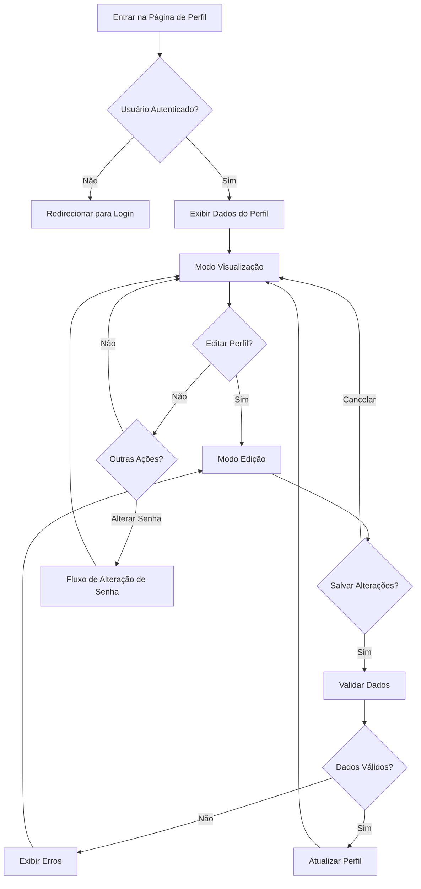

# Workflow: Criação da Página de Perfil

Data: 2025-03-15

## Análise Inicial [✅]

### Análise do Código Existente

- [✅] Verificação da estrutura do projeto
- [✅] Identificação dos componentes relevantes
- [✅] Análise do contexto de autenticação

### Requisitos Técnicos

- [✅] Criar uma página de perfil para o usuário autenticado
- [✅] Integrar com o sistema de autenticação existente
- [✅] Garantir consistência com o design do sistema
- [✅] Incluir funcionalidades de visualização e edição de dados do perfil

## Perguntas para Esclarecimento de Requisitos [✅]

1. Quais informações do usuário devem ser exibidas na página de perfil?
2. O usuário poderá editar quais informações do seu perfil?
3. Há necessidade de funcionalidades adicionais como alteração de senha?
4. Quais validações devem ser implementadas para os campos editáveis?
5. Existem requisitos específicos de design para esta página?

## Fluxograma da Página de Perfil [✅]

## Tarefas para Implementação [✅]

### 1. Estrutura Básica da Página

- [✅] Criar diretório `/src/pages/profile`
- [✅] Criar componente principal `ProfilePage.jsx`
- [✅] Integrar com o Layout principal e sistema de rotas

### 2. Componentes da Página de Perfil

- [✅] Criar componente `ProfileView.jsx` para modo de visualização
- [✅] Criar componente `ProfileEdit.jsx` para modo de edição
- [✅] Criar componente `ChangePassword.jsx` para alteração de senha
- [✅] Integrar componentes na página principal

### 3. Integração com API/Contexto

- [✅] Adaptar `AuthContext` para incluir dados do perfil
- [✅] Implementar funções para atualização de dados do perfil
- [✅] Adicionar validação de formulários
- [✅] Implementar tratamento de erros

### 4. Estilização e UI

- [✅] Desenvolver interface seguindo padrões do Material-UI
- [✅] Garantir responsividade para diferentes dispositivos
- [✅] Implementar feedbacks visuais (sucesso, erro, carregamento)
- [✅] Adicionar animações e transições para melhor UX

### 5. Testes e Finalização

- [✅] Testar funcionalidades básicas
- [✅] Verificar responsividade
- [✅] Testar cenários de erro
- [✅] Revisar código e documentação

## Registro de Erros [✅]

- Nenhum erro significativo encontrado durante o desenvolvimento

## Observações

- A implementação seguiu o padrão de componentes funcionais com hooks
- Foram utilizados os componentes do Material-UI para manter consistência com o restante da aplicação
- O gerenciamento de estado foi feito através do AuthContext existente
- A página de perfil inclui uma interface com abas para separar as informações pessoais da área de segurança
- Foi implementado um sistema de feedback visual para o usuário durante a edição do perfil
- A página é totalmente responsiva, adaptando-se a diferentes tamanhos de tela
