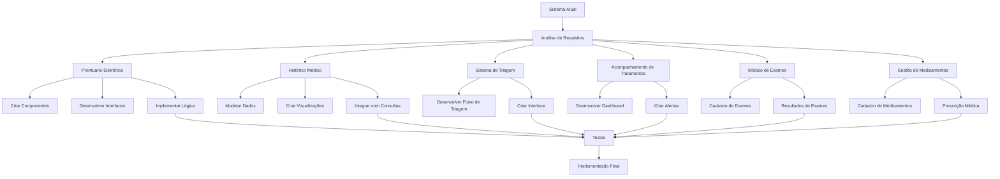

# Workflow: Aprimoramento do Sistema de Atendimento Médico

## Análise Inicial

### Análise do Código Existente

- [✅] Identificado componente ConsultaFormModal.jsx para agendamento de consultas
- [✅] Identificado página Consultas.jsx que gerencia listagem de consultas
- [✅] Analisado estrutura de dados atual dos médicos e consultas
- [✅] Verificado implementação atual de status das consultas

### Identificação de Pontos de Melhoria

- [✅] Implementar novo módulo de prontuário eletrônico
- [✅] Criar sistema de histórico médico dos pacientes
- [✅] Desenvolver funcionalidade de triagem
- [⏳] Implementar sistema de acompanhamento de tratamentos
- [⏳] Adicionar módulo de exames médicos
- [⏳] Melhorar gestão de medicamentos

## Fluxograma da Implementação

## Implementação das Novas Funcionalidades

### 1. Prontuário Eletrônico

- [✅] Criar modelo de dados para prontuário
- [✅] Desenvolver componente de visualização de prontuário
- [✅] Implementar formulário para registro de prontuário
- [✅] Integrar com sistema de consultas existente

### 2. Histórico Médico dos Pacientes

- [✅] Modelar estrutura de dados para histórico médico
- [✅] Criar componente de visualização cronológica de histórico
- [✅] Implementar filtros de pesquisa no histórico
- [✅] Desenvolver exportação de histórico em PDF

### 3. Sistema de Triagem

- [✅] Desenvolver fluxo de triagem com classificação de risco
- [✅] Criar formulário de triagem com sinais vitais
- [✅] Implementar dashboard de pacientes em espera
- [✅] Adicionar alertas para casos prioritários

### 4. Acompanhamento de Tratamentos

- [⏳] Criar modelo de dados para tratamentos contínuos
- [⏳] Desenvolver interface de acompanhamento de tratamento
- [⏳] Implementar sistema de lembretes para pacientes
- [⏳] Adicionar gráficos de evolução de tratamento

### 5. Módulo de Exames

- [⏳] Desenvolver cadastro de tipos de exames
- [⏳] Criar formulário de solicitação de exames
- [⏳] Implementar visualizador de resultados de exames
- [⏳] Adicionar alertas para resultados críticos

### 6. Gestão de Medicamentos

- [⏳] Criar cadastro de medicamentos com posologia
- [⏳] Desenvolver sistema de prescrição médica
- [⏳] Implementar controle de estoque de medicamentos
- [⏳] Adicionar alertas de interações medicamentosas

## Registros de Erros e Soluções

- [⏳] Documentar erros encontrados durante o desenvolvimento
- [⏳] Registrar soluções aplicadas 
