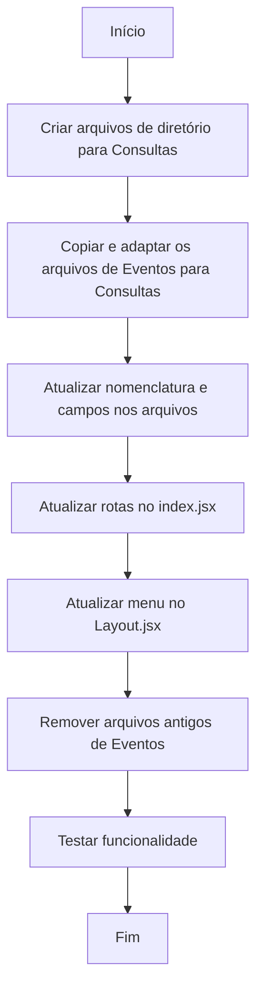

# Workflow: Trocar Eventos por Consultas

## Análise Inicial

- [✅] Analisar o código existente relacionado a Eventos
- [✅] Identificar todos os arquivos que precisam ser modificados
- [✅] Planejar a estrutura da nova funcionalidade de Consultas
- [✅] Criar fluxograma da implementação

## Arquivos Identificados para Modificação

- [✅] `src/pages/events/Events.jsx` → Renomear para `src/pages/consultas/Consultas.jsx`
- [✅] `src/components/events/EventFormModal.jsx` → Renomear para `src/components/consultas/ConsultaFormModal.jsx`
- [✅] `src/routes/index.jsx` → Atualizar rota de Eventos para Consultas
- [✅] `src/components/Layout.jsx` → Atualizar item de menu de Eventos para Consultas

## Fluxograma da Implementação

## Implementação

### 1. Criar Estrutura de Diretórios

- [✅] Criar diretório `src/pages/consultas`
- [✅] Criar diretório `src/components/consultas`

### 2. Adaptar Arquivos

- [✅] Criar `Consultas.jsx` com base em `Events.jsx`
- [✅] Criar `ConsultaFormModal.jsx` com base em `EventFormModal.jsx`
- [✅] Adaptar nomenclatura e campos dos arquivos
  - [✅] Trocar "Evento" por "Consulta"
  - [✅] Adaptar campos específicos (data, local → paciente, horário, médico)
  - [✅] Atualizar modelos de dados

### 3. Atualizar Rotas e Menu

- [✅] Atualizar rota em `src/routes/index.jsx`
- [✅] Atualizar item de menu em `src/components/Layout.jsx`

### 4. Remover Arquivos Antigos

- [✅] Remover `src/pages/events/Events.jsx`
- [✅] Remover `src/components/events/EventFormModal.jsx`

### 5. Testar Funcionalidade

- [⏳] Verificar navegação para a página de Consultas
- [⏳] Testar formulário de criação de Consultas
- [⏳] Validar exibição das Consultas cadastradas 

## Resumo das Alterações

### Mudanças Realizadas

1. Criados os diretórios necessários para a nova funcionalidade de Consultas
2. Criado o componente `Consultas.jsx` com base no `Events.jsx`
3. Criado o componente `ConsultaFormModal.jsx` com base no `EventFormModal.jsx`
4. Adaptado o modelo de dados para consultas médicas:
   - Adicionados campos específicos: paciente, horário, médico, especialidade e status
   - Removidos campos desnecessários para consultas
5. Atualizada a navegação no menu lateral
6. Atualizada a configuração de rotas
7. Removidos os arquivos antigos de eventos

### Próximos Passos

- Realizar testes da funcionalidade
- Validar a criação e visualização de consultas
- Verificar a navegação e interação do usuário
