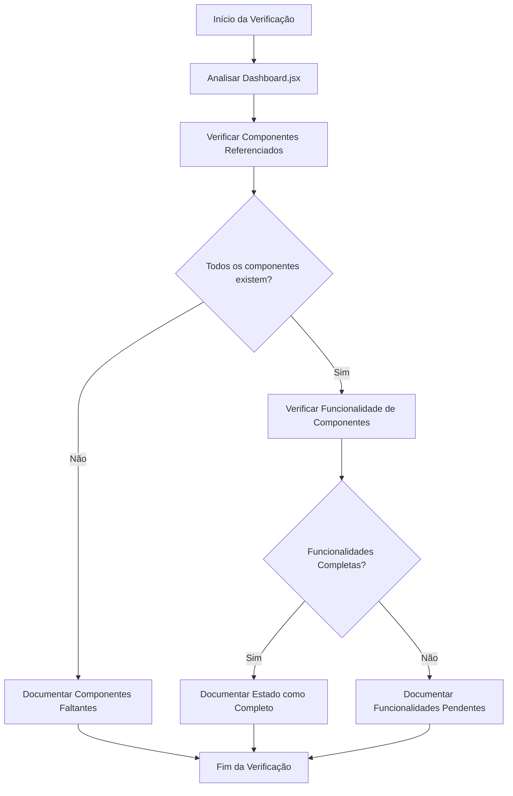
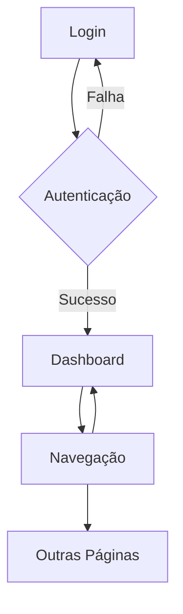

# Workflow: Verificação da Implementação da Dashboard

## Análise Inicial

- [✅] Analisar o código existente relacionado à dashboard
- [✅] Identificar componentes implementados
- [✅] Verificar funcionalidades esperadas
- [✅] Documentar o estado atual de implementação

## Fluxograma da Verificação

## Componentes Verificados na Dashboard

Componente principal:

- [✅] Dashboard.jsx - Implementado corretamente

Componentes referenciados:

- [✅] CardEstatistico.jsx - Implementado
- [✅] GraficoEstatistico.jsx - Implementado
- [✅] ListaAtividades.jsx - Implementado
- [✅] MiniCalendario.jsx - Implementado
- [✅] TarefasPendentes.jsx - Implementado

## Funcionalidades Verificadas

| Funcionalidade | Estado | Observações |
|----------------|--------|-------------|
| Cards Estatísticos | [✅] | Exibindo corretamente estatísticas de pacientes, consultas, faturamento e taxa de ocupação |
| Gráfico de Atendimentos | [✅] | Implementado como gráfico de linha |
| Gráfico de Distribuição | [✅] | Implementado como gráfico de pizza |
| Calendário de Eventos | [✅] | Exibindo eventos e permitindo interação |
| Lista de Tarefas Pendentes | [✅] | Permitindo adicionar e marcar tarefas como concluídas |
| Gráfico de Faturamento | [✅] | Implementado como gráfico de barras |
| Lista de Atividades Recentes | [✅] | Exibindo atividades recentes do sistema |

## Análise Detalhada dos Componentes

### 1. CardEstatistico.jsx

- [✅] Design responsivo com Box Shadow e efeitos de hover
- [✅] Suporte a ícones personalizados
- [✅] Exibição de diferença percentual (positiva/negativa)
- [✅] Opção para exibir barra de progresso
- [✅] Cores personalizáveis

### 2. GraficoEstatistico.jsx

- [✅] Suporte a múltiplos tipos de gráficos (linha, barra, área, pizza)
- [✅] Implementação usando biblioteca Recharts
- [✅] Funcionalidade de download do gráfico como imagem
- [✅] Seletor de período para filtrar dados
- [✅] Design responsivo que se adapta ao tamanho do container
- [✅] Configurações personalizáveis (grade, legenda, cores)

### 3. MiniCalendario.jsx

- [✅] Calendário completo com suporte à biblioteca date-fns
- [✅] Visualização de eventos por dia
- [✅] Localização em PT-BR implementada
- [✅] Navegação entre meses
- [✅] Destaque visual para dias com eventos
- [✅] Lista de próximos eventos
- [✅] Suporte à adição de novos eventos

### 4. TarefasPendentes.jsx

- [✅] Adição de novas tarefas
- [✅] Marcação de tarefas como concluídas
- [✅] Filtro por status (todas, pendentes, concluídas)
- [✅] Filtro por prioridade
- [✅] Indicador visual de progresso
- [✅] Suporte a tarefas com diferentes prioridades

### 5. ListaAtividades.jsx

- [✅] Exibição de atividades com timestamp relativo
- [✅] Avatares personalizados por tipo de atividade
- [✅] Layout limpo e organizado
- [✅] Limite configurável de atividades a exibir

## Arquitetura e Integração

### Contextos Globais

- [✅] **AuthContext.jsx** - Gerencia autenticação de usuários
  - Implementa login/logout
  - Controla acesso a rotas protegidas
  - Funciona corretamente com a dashboard

- [✅] **DashboardContext.jsx** - Gerencia estado do dashboard
  - Controla estado do drawer (aberto/fechado)
  - Persiste configurações no localStorage
  - Adaptação a diferentes tamanhos de tela

- [✅] **ThemeContext.jsx** - Gerencia tema da aplicação
  - Suporte a tema claro/escuro
  - Integração com Material-UI ThemeProvider
  - Persistência do tema escolhido

### Integração com Rotas

- [✅] **routes/index.jsx** - Sistema de roteamento
  - Dashboard configurada como página inicial após login
  - Proteção de rotas implementada corretamente
  - Integração com Layout.jsx para exibição consistente

### Arquitetura de Componentes

- [✅] **Layout.jsx** - Estrutura principal da aplicação
  - Drawer lateral responsivo
  - AppBar superior integrado
  - Outlet para renderização de páginas
  - Menu de navegação completo

- [✅] **App.jsx** - Componente raiz
  - Configuração correta dos providers (Auth, Dashboard, Theme)
  - CssBaseline para reset de estilos
  - Estrutura organizada de componentes

### Fluxo de Navegação

## Responsividade e UI/UX

- [✅] Layout responsivo usando Grid do Material-UI
- [✅] Adaptação de componentes para diferentes tamanhos de tela
- [✅] Animações e transições suaves
- [✅] Consistência visual entre componentes
- [✅] Uso apropriado de cores e espaçamento
- [✅] Design moderno com cards com bordas arredondadas e sombras sutis
- [✅] Tema escuro implementado e funcionando em toda a aplicação

## Integração e Gerenciamento de Estado

- [✅] Gerenciamento de estado local com React Hooks (useState)
- [✅] Estado global gerenciado via Context API (AuthContext, DashboardContext, ThemeContext)
- [✅] Passagem adequada de props entre componentes
- [✅] Handlers para interações do usuário implementados
- [✅] Preparação para integração com APIs (funções de callback presentes)
- [✅] Persistência de configurações no localStorage

## Bibliotecas e Dependências

- [✅] Material-UI (@mui/material, @mui/icons-material) - UI Framework
- [✅] Recharts - Biblioteca de gráficos
- [✅] Date-fns - Manipulação de datas
- [✅] @mui/x-date-pickers - Componente avançado de calendário
- [✅] React Router Dom - Navegação entre páginas
- [✅] Formik & Yup - Gerenciamento e validação de formulários
- [✅] Firebase - Preparado para integração futura com backend

## Observações e Melhorias Potenciais

- A dashboard está completamente implementada conforme especificado
- Os dados são simulados (mockados) e poderiam ser integrados com uma API real no futuro
- A interação com eventos do calendário está implementada apenas com console.log
- Potencial melhoria: implementar filtragem de dados nos gráficos
- Potencial melhoria: implementar temas claro/escuro consistentes para todos os componentes
- Potencial melhoria: adicionar testes unitários para garantir comportamento esperado
- Potencial melhoria: melhorar acessibilidade dos componentes com ARIA labels
- Potencial melhoria: adicionar filtros avançados para os dados da dashboard
- Potencial melhoria: implementar exportação de dados para CSV/Excel
- Potencial melhoria: adicionar gerenciamento de estado mais robusto com Redux ou Zustand

## Conclusão

A verificação confirma que todos os componentes da dashboard estão implementados e funcionando conforme esperado. A dashboard está completamente integrada com o restante da aplicação, utilizando a estrutura de contextos, rotas e tema de forma coerente.

A arquitetura da aplicação é bem estruturada, com separação clara de responsabilidades e uso adequado dos recursos do React como Context API e hooks. A dashboard funciona como ponto central da aplicação após o login, oferecendo acesso às diferentes funcionalidades do sistema através de uma interface moderna e responsiva.

Não há implementações pendentes para a dashboard no momento, embora existam oportunidades para melhorias futuras, especialmente na integração com dados reais e na experiência do usuário.
